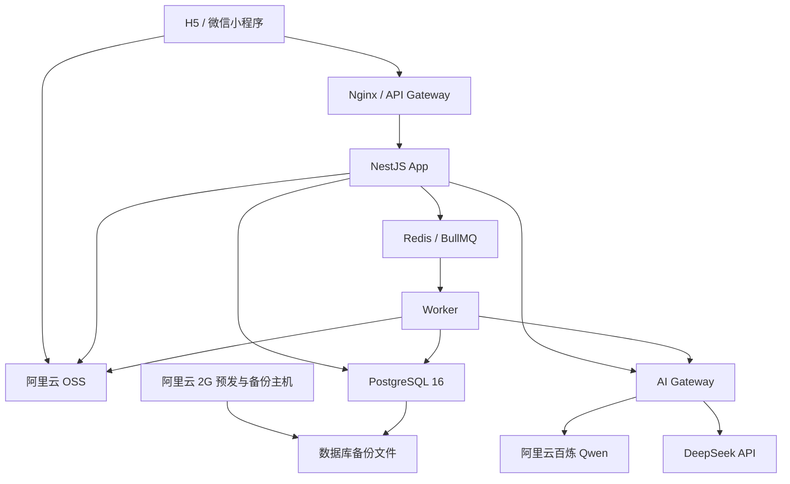
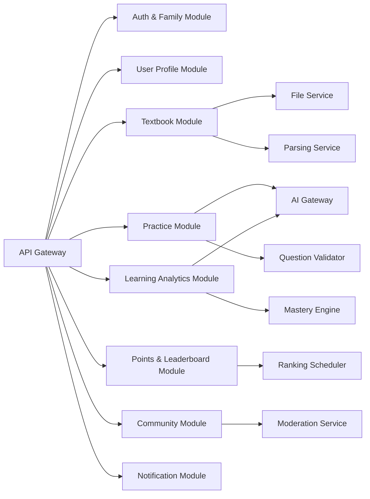
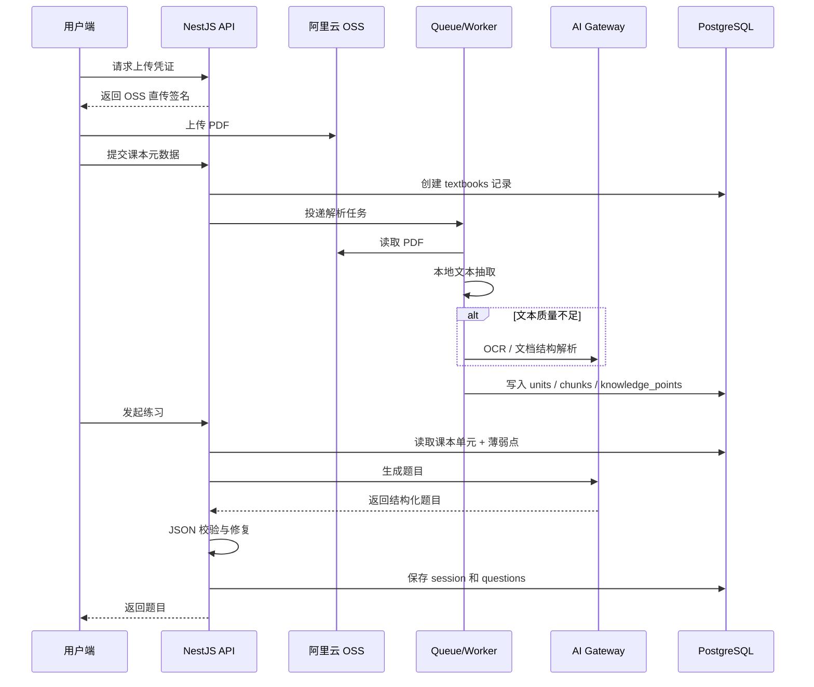
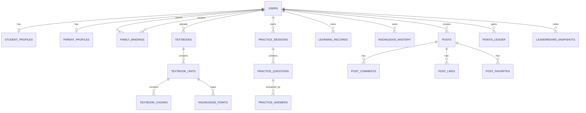

# 小学生全科智能复习助手 PRD 与系统设计

## 文档信息
- 项目名称：小学生全科智能复习助手
- 文档版本：v1.1（2026-03-15 更新）
- 文档状态：生产可用版本
- 文档日期：2026-03-15（最新修订）
- 产品形态：H5 + 微信小程序
- 目标用户：小学 1-6 年级学生、学生家长
- 技术基线：Taro 4 + React 18 + Express + MySQL 8.0 + Redis 3.0 + Prisma ORM

---

## 1. 项目概述

### 1.1 项目定位
本项目是一个面向小学 1-6 年级学生的 AI 智能复习工具，帮助学生围绕课本内容完成日常复习、单元巩固和薄弱点强化训练，同时为家长提供学习进度、复习效果和薄弱知识点的可视化追踪能力。

### 1.2 核心目标
- 基于课本内容、年级、科目、单元生成适配练习题
- 根据学生历史答题数据识别薄弱知识点并进行针对性训练
- 支持语音播报，降低小学生独立使用门槛
- 为家长提供清晰的学习记录、统计分析和成长趋势
- 提供积分、排行榜和社区功能，增强持续使用动力

### 1.3 产品原则
- 以学习闭环优先：上传教材、练习、记录、分析、再练习
- AI 可控而非纯生成：所有题目必须带知识点、难度、答案和解析
- 优先国内可落地方案：兼顾微信小程序、对象存储、中文模型和部署成本
- 先按模块化单体设计：满足现有服务器资源条件，后续可拆分扩容

---

## 2. 用户体系与权限设计

### 2.1 用户角色

| 角色 | 说明 | 核心能力 |
|---|---|---|
| 学生账号 | 核心学习账号 | 做题、查看积分、查看个人记录、查看排行榜 |
| 家长账号 | 监护账号 | 绑定学生、查看学习数据、发布社区内容、管理孩子设置 |
| 平台管理员 | 运营/审核账号 | 内容审核、教材管理、排行榜巡检、异常处理 |

### 2.2 账号关系
- 学生和家长为两个独立账号
- 通过家庭绑定关系建立关联
- 一个家长可绑定多个学生
- 一个学生可绑定一个或多个家长
- 家长查看详细学习数据需完成绑定验证

### 2.3 权限边界

| 功能 | 学生 | 家长 | 管理员 |
|---|---|---|---|
| 做题与查看解析 | 是 | 否 | 否 |
| 查看学生详细学习数据 | 仅本人 | 仅已绑定学生 | 是 |
| 上传课本 | 是 | 是 | 是 |
| 发布社区内容 | 否，默认仅浏览 | 是 | 是 |
| 查看排行榜 | 是 | 是 | 是 |
| 内容审核 | 否 | 否 | 是 |

说明：
- 社区范围为全平台公开
- 出于未成年人内容安全考虑，默认仅家长账号可发帖、评论和收藏，学生账号默认浏览
- 后续如需开放学生社区，需要新增学生专区、审核策略和家长授权机制

---

## 3. 产品范围与版本规划

### 3.1 完整功能范围

| 模块 | 功能点 | 版本目标 |
|---|---|---|
| 账号与家庭 | 学生/家长注册登录、家庭绑定、权限控制 | V1 |
| 首页 | 今日学习卡片、积分、连续打卡、学习建议、快捷入口 | V1 |
| 课本管理 | PDF 上传、课本列表、课本封面、单元识别、重解析 | V1 |
| 智能练习 | 按课本 + 年级 + 科目 + 单元 + 薄弱点生成题目 | V1 |
| 语音播报 | H5 浏览器语音、微信小程序服务端 TTS 音频 | V1 |
| 学习记录 | 历史记录、统计卡片、学习日历、薄弱点分析 | V1 |
| 积分系统 | 答题积分、奖励积分、积分明细、等级 | V1 |
| 排行榜 | 全平台总榜、周榜、月榜、科目榜 | V1 |
| 家长社区 | 帖子、评论、点赞、收藏、筛选 | V1.1 |
| 错题与强化 | 错题本、相似题推荐、专项练习 | V1.1 |
| 学习报告 | 周报、月报、导出、家长建议 | V1.2 |
| RAG 增强 | 向量检索、课本问答、知识点追问 | V1.2 |

### 3.2 迭代建议

| 阶段 | 目标 | 范围 |
|---|---|---|
| Phase 0 | 工程与基础设施 | 仓库初始化、部署、数据库、对象存储、AI 网关 |
| Phase 1 | 学习闭环 | 登录、绑定、上传课本、解析、AI 出题、答题、记录、积分 |
| Phase 2 | 数据强化 | 学习日历、薄弱点分析、个性化建议、排行榜 |
| Phase 3 | 平台扩展 | 家长社区、内容审核、学习报告、推送通知 |
| Phase 4 | 智能增强 | pgvector、相似题推荐、课本问答、错题强化 |

---

## 4. 业务规则补全

### 4.1 课本来源
- 前期支持用户上传 PDF 课本
- 平台预置教材作为后续能力保留，但 V1 以上传 PDF 为主
- 同一课本支持重复上传去重校验
- 支持按科目、年级、学期、版本管理教材

### 4.2 AI 出题规则
- 出题输入维度：课本内容 + 年级 + 科目 + 单元 + 学生薄弱点
- 每次默认生成 5 道题
- 题型支持：单选题、填空题、判断题
- 每道题必须返回：
  - 题目内容
  - 选项或标准答案
  - 正确答案
  - 解析
  - 知识点标签
  - 难度标签
- 题目生成后进入结构校验，确保 JSON 合法和字段完整

### 4.3 薄弱点识别规则
- 不只依赖大模型推断，采用规则与模型结合
- 每道题绑定知识点标签
- 记录学生在知识点维度上的答题数量、正确率、最近作答时间、连续错误次数
- 出题时优先抽取近 14 天低掌握度知识点
- 推荐策略遵循：
  - 最近常错优先
  - 长期未复习次优先
  - 避免连续只出同一知识点，控制体验

### 4.4 积分规则
- 每答对 1 题 +10 积分
- 单次练习正确率大于等于 80%，额外 +20 积分
- 连续打卡奖励可在 V1.1 追加
- 排行榜默认按有效积分统计，作弊或异常记录可剔除

### 4.5 社区规则
- 社区为全平台公开浏览
- 默认家长账号可发帖、评论、点赞、收藏
- 帖子支持按科目筛选
- 社区接入敏感词过滤和内容审核任务流

---

## 5. 非功能需求

### 5.1 性能目标
- 页面首屏加载小于 2 秒
- 普通 AI 出题小于 5 秒
- 课本上传后基础解析状态回传小于 3 秒
- H5 语音播报触发延迟小于 1 秒
- 排行榜接口缓存后响应小于 300ms

### 5.2 可用性目标
- 支持 H5 与微信小程序
- 核心学习路径在 3 步内完成
- 所有关键操作具备明确反馈

### 5.3 安全目标
- 学生数据与家长数据逻辑隔离
- 家长查看详细学习数据必须基于绑定关系
- 关键接口需要鉴权、限流、审计日志
- 社区内容接入审核流程

### 5.4 运维目标
- 生产环境每日自动备份数据库
- 关键任务失败可重试
- AI 调用记录可追踪
- 关键异常具备告警能力

---

## 6. 技术选型与落地方案

### 6.1 总体选型（2026-03-15 更新）

| 层级 | 选型 | 结论 | 变更说明 |
|---|---|---|---|
| 前端 | Taro 4 + React 18 | 保持 PRD 方案，支持 H5 与微信小程序 | - |
| 后端 | Express + Prisma ORM | 模块化单体，快速交付 | **变更**：从 NestJS 改为 Express（更轻量） |
| 数据库 | MySQL 8.0 | 主库首选，成本低、运维简单 | **变更**：从 PostgreSQL 改为 MySQL（3 年省 5.6 万） |
| 缓存/队列 | Redis 3.0 + BullMQ | 排行榜缓存、异步解析、异步报告 | - |
| 对象存储 | 本地文件存储（backend/uploads/） | 存 PDF、封面、头像、附件 | **变更**：从阿里云 OSS 改为本地存储（等稳定后再上 OSS） |
| AI 网关 | 服务端统一封装 | 前端不直接调用模型 | - |
| 向量能力 | 外部向量服务（V1.2） | V1.2 开启（阿里云 DashVector） | **变更**：从 pgvector 改为外部服务 |
| 部署方式 | 直接部署（Node.js 服务） | 适合现有两台服务器规模 | - |

### 6.2 服务器选型与角色划分（2026-03-15 更新）

你当前已有资源：
- 阿里云服务器：2G 内存 + 40G 硬盘
- 京东云服务器：4G 内存 + 60G 硬盘

最终建议如下：

| 服务器 | 角色 | 部署内容 | 结论 |
|---|---|---|---|
| 本地开发环境 | 开发/测试 | MySQL 8.0、Redis 3.0、Express API、React 前端 | 当前开发环境 |
| 京东云 4G/60G | 生产主机 | Nginx、Express API、Worker、MySQL 8.0、Redis、本地文件存储 | 作为主生产环境 |
| 阿里云 2G/40G | 预发/备份主机 | Staging、备份脚本、日志归档、运维工具 | 作为预发与容灾辅助 |

### 6.3 为什么这样选（2026-03-15 更新）

**数据库选型（MySQL vs PostgreSQL）**：
- ✅ MySQL 8.0 完全免费（社区版），3 年省约 5.6 万元
- ✅ MySQL 运维简单，中文资料极多，好招人
- ✅ 学习助手读多写少场景，MySQL 性能足够
- ⚠️ V1.2 向量检索需使用外部服务（阿里云 DashVector）
- **决策**：俊哥确认使用 MySQL 8.0（成本优先）

**文件存储选型（本地 vs OSS）**：
- ✅ 本地存储零成本，无需配置阿里云账号
- ✅ 开发测试更方便，后续迁移服务器只需改路径
- ✅ 等运行稳定后再购买阿里云 OSS 服务
- **决策**：先使用本地文件存储（`backend/uploads/`）

**服务器部署**：
- 4G 内存更适合承载生产流量和数据库
- 60G 硬盘更适合作为主库初期存储
- 2G 机器不适合同时跑生产 API、数据库和队列
- 阿里云可结合本地存储做备份，适合承接备份文件
- 两台机器分工明确后，能降低单机资源争抢风险

### 6.4 生产部署建议（2026-03-15 更新）

| 组件 | 部署位置 | 说明 |
|---|---|---|
| Nginx | 京东云 | HTTPS、静态文件、反向代理 |
| API 服务 | 京东云 | Express 主服务 |
| Worker | 京东云 | PDF 解析、排行榜计算、报告生成 |
| MySQL 8.0 | 京东云 | 主业务数据库 |
| Redis 3.0 | 京东云 | 缓存与队列 |
| 本地文件存储 | 京东云 | `backend/uploads/` 目录（PDF、封面、头像、附件） |
| Staging API | 阿里云 | 预发环境、联调环境 |
| 数据库备份文件 | 阿里云 + 本地备份 | 双份保存 |

### 6.5 容量预估

| 组件 | 生产内存预估 |
|---|---:|
| 操作系统与基础进程 | 500MB |
| Nginx | 80MB |
| NestJS API | 500MB - 700MB |
| Worker | 400MB - 700MB |
| PostgreSQL | 900MB - 1300MB |
| Redis | 100MB - 200MB |
| 合计 | 2480MB - 3480MB |

说明：
- 4G 生产机可支撑 MVP 阶段
- 需避免本地重型 OCR 和大批量并发解析
- 大文件上传走客户端直传 OSS，减轻主机负担

### 6.6 数据库选型对比（2026-03-15 更新）

| 方案 | 是否采用 | 原因 | 3 年成本 |
|---|---|---|---|
| **MySQL 8.0** | ✅ **已采用** | 完全免费、运维简单、资料极多、成本低 | **¥96,520** |
| PostgreSQL 16 | 备选 | 功能强大、支持 pgvector，但运维复杂、成本高 | ¥152,600 |
| Oracle | 否 | 成本高、运维重、对当前产品收益不明显 | ¥500,000+ |
| SQL Server | 否 | 更适合 .NET 生态，当前技术栈没有明显优势 | ¥200,000+ |

**决策说明**：
- ✅ MySQL 8.0 3 年省约 5.6 万元
- ✅ MySQL 运维简单，中文资料极多，好招人
- ✅ 学习助手读多写少场景，MySQL 性能足够
- ⚠️ V1.2 向量检索需使用外部服务（阿里云 DashVector）
- **决策人**：俊哥（成本优先策略）

---

## 7. 模型路由与模型选型

### 7.1 设计原则
- 所有模型调用都通过后端 `AI Gateway` 统一管理
- 区分同步链路和异步链路，避免高延迟模型阻塞答题
- 优先本地规则和程序解析，模型只用于复杂提取和内容生成
- 所有题目生成结果必须做结构校验和兜底重试

### 7.2 模型服务选型

| 任务 | 主模型 | 备模型 | 调用方式 | 说明 |
|---|---|---|---|---|
| PDF 结构化解析 | Qwen-Doc-Turbo | 无 | 异步 | 用于课本目录、单元、章节结构抽取 |
| 扫描版 PDF OCR | Qwen-VL-OCR | 无 | 异步 | 仅在本地文本提取失败时启用 |
| 常规出题 | qwen-flash | deepseek-chat | 同步 | 低成本、高并发，适合 5 题一组 |
| 个性化出题 | qwen-plus | deepseek-chat | 同步 | 注入薄弱点、年级、单元限制 |
| 薄弱点分析 | qwen-plus | deepseek-reasoner | 异步 | 生成学习建议、复习策略 |
| 高质量复核 | qwen-max | deepseek-reasoner | 异步 | 用于抽检和疑难题复核 |
| 结构修复 | qwen-flash | deepseek-chat | 同步 | 非法 JSON 修复、字段补齐 |
| TTS 音频生成 | qwen-tts | 浏览器语音降级 | 同步/缓存 | 小程序侧优先服务端生成音频 |

说明：
- H5 优先调用浏览器内建语音能力，节省成本
- 微信小程序不依赖 Web Speech API，建议走服务端 TTS 音频下发
- 出题主链路不使用高成本长思维模型

### 7.3 模型路由策略

| 场景 | 路由策略 |
|---|---|
| 普通练习生成 | `qwen-flash` 直出，失败后重试一次 |
| 薄弱点强化生成 | `qwen-plus`，失败降级到 `qwen-flash` |
| 课本解析 | 先走本地文本抽取，再根据文本质量决定是否调用 `Qwen-Doc-Turbo` 或 `Qwen-VL-OCR` |
| 大模型返回 JSON 非法 | 先走本地 schema 修复，失败再调用 `qwen-flash` 做结构修复 |
| 深度分析报告 | 异步队列执行，不阻塞学生主流程 |

### 7.4 为什么不一开始做重型 RAG
- V1 出题主要依赖“指定课本单元 + 学生薄弱点”
- 当前只需按单元读取教材片段，不需要跨海量资料库检索
- PostgreSQL + `pgvector` 已能满足后续相似检索需求
- 不建议在 V1 引入独立向量数据库，避免部署和运维复杂化

---

## 8. 系统架构设计

### 8.1 总体架构图



### 8.2 后端模块拆分图



### 8.3 教材解析与出题时序图



---

## 9. 核心模块设计

### 9.1 账号与家庭模块
- 登录方式：手机号验证码登录，后续可扩展微信授权登录
- 账号类型：学生、家长、管理员
- 家庭绑定：
  - 家长发起绑定
  - 学生确认或平台校验
  - 绑定后家长可查看学生详细数据
- 权限控制：
  - 使用 JWT Access Token + Refresh Token
  - 接口层进行角色鉴权和资源鉴权

### 9.2 教材模块
- 支持 PDF 上传
- 支持封面自动生成或默认封面
- 支持课本目录、单元、章节识别
- 支持重新解析
- 支持平台预置教材扩展

### 9.3 练习模块
- 创建练习 session
- 基于教材、年级、科目、单元、薄弱点生成题目
- 即时提交答案并返回结果
- 结束后写入学习记录、积分、知识点掌握度

### 9.4 学习分析模块
- 统计今日学习时长、总题数、正确率、连续打卡
- 生成学习日历
- 计算知识点掌握度和薄弱点
- 为首页和家长端输出个性化建议

### 9.5 社区模块
- 帖子列表、发帖、评论、点赞、收藏
- 热门、最新、按科目筛选
- 敏感词过滤和人工审核任务

### 9.6 排行榜模块
- 计算全平台总榜、周榜、月榜、科目榜
- 采用缓存 + 定时快照机制
- 支持展示前三名样式和用户排名定位

---

## 10. 数据库设计（2026-03-15 更新）

### 10.1 数据库选型结论
- **数据库**：MySQL 8.0（社区版，完全免费）
- **ORM**：Prisma 5（支持 MySQL/PostgreSQL/SQLite 无缝切换）
- **原因**：
  - 关系数据、统计查询支持良好
  - 与 Express + Prisma 生态兼容
  - 成本低，3 年省约 5.6 万元
  - 运维简单，中文资料极多
- **V1.2 向量检索方案**：阿里云 DashVector（外部服务）

### 10.1.1 数据库变更记录

| 变更日期 | 变更内容 | 变更原因 | 决策人 |
|----------|----------|----------|--------|
| 2026-03-15 | 从 PostgreSQL 16 改为 MySQL 8.0 | 成本优先，3 年省 5.6 万，运维更简单 | 俊哥 |
| 2026-03-15 | 从阿里云 OSS 改为本地文件存储 | 等运行稳定后再购买 OSS 服务 | 俊哥 |

### 10.2 ER 图



### 10.3 账号与家庭相关表

#### `users`

| 字段 | 类型 | 说明 |
|---|---|---|
| id | uuid pk | 用户主键 |
| role | varchar(20) | `student` / `parent` / `admin` |
| phone | varchar(32) unique | 登录手机号 |
| password_hash | varchar(255) nullable | 预留密码登录 |
| nickname | varchar(64) | 昵称 |
| avatar_url | text | 头像 |
| status | varchar(20) | `active` / `disabled` |
| last_login_at | timestamptz | 最近登录时间 |
| created_at | timestamptz | 创建时间 |
| updated_at | timestamptz | 更新时间 |

索引建议：
- `idx_users_role`
- `idx_users_phone`

#### `student_profiles`

| 字段 | 类型 | 说明 |
|---|---|---|
| user_id | uuid pk fk | 学生用户 ID |
| grade | varchar(20) | 年级 |
| school_name | varchar(128) nullable | 学校名称 |
| gender | varchar(10) nullable | 性别 |
| total_points | integer default 0 | 总积分 |
| streak_days | integer default 0 | 连续打卡天数 |
| settings | jsonb | 个性化配置 |
| created_at | timestamptz | 创建时间 |
| updated_at | timestamptz | 更新时间 |

#### `parent_profiles`

| 字段 | 类型 | 说明 |
|---|---|---|
| user_id | uuid pk fk | 家长用户 ID |
| real_name | varchar(64) nullable | 真实姓名 |
| verified_status | varchar(20) | `pending` / `verified` |
| relation_note | varchar(64) nullable | 关系备注 |
| created_at | timestamptz | 创建时间 |
| updated_at | timestamptz | 更新时间 |

#### `family_bindings`

| 字段 | 类型 | 说明 |
|---|---|---|
| id | uuid pk | 主键 |
| parent_user_id | uuid fk | 家长用户 ID |
| student_user_id | uuid fk | 学生用户 ID |
| relation_type | varchar(20) | `father` / `mother` / `guardian` |
| status | varchar(20) | `active` / `pending` / `revoked` |
| is_primary | boolean | 是否主监护人 |
| created_at | timestamptz | 创建时间 |
| updated_at | timestamptz | 更新时间 |

唯一约束建议：
- `uniq_parent_student_binding(parent_user_id, student_user_id)`

### 10.4 教材与知识点相关表

#### `textbooks`

| 字段 | 类型 | 说明 |
|---|---|---|
| id | uuid pk | 课本主键 |
| owner_user_id | uuid fk | 上传人 |
| source_type | varchar(20) | `uploaded` / `platform` |
| subject | varchar(20) | 语文/数学/英语 |
| grade | varchar(20) | 年级 |
| term | varchar(20) nullable | 上/下学期 |
| publisher | varchar(64) nullable | 出版版本 |
| title | varchar(128) | 标题 |
| cover_url | text nullable | 封面地址 |
| pdf_url | text | PDF 地址 |
| pdf_file_key | varchar(255) | OSS 文件 Key |
| page_count | integer default 0 | 页数 |
| unit_count | integer default 0 | 单元数 |
| parse_status | varchar(20) | `pending` / `processing` / `success` / `failed` |
| parse_result | jsonb nullable | 解析结果摘要 |
| created_at | timestamptz | 创建时间 |
| updated_at | timestamptz | 更新时间 |

索引建议：
- `idx_textbooks_owner_subject_grade`
- `idx_textbooks_parse_status`

#### `textbook_units`

| 字段 | 类型 | 说明 |
|---|---|---|
| id | uuid pk | 单元主键 |
| textbook_id | uuid fk | 所属课本 |
| parent_unit_id | uuid nullable | 父级节点 |
| level | smallint | 1=单元，2=章节，3=小节 |
| unit_code | varchar(32) nullable | 编码 |
| title | varchar(128) | 标题 |
| sort_order | integer | 排序 |
| start_page | integer nullable | 起始页 |
| end_page | integer nullable | 结束页 |
| summary | text nullable | 摘要 |
| created_at | timestamptz | 创建时间 |
| updated_at | timestamptz | 更新时间 |

#### `textbook_chunks`

| 字段 | 类型 | 说明 |
|---|---|---|
| id | uuid pk | 分片主键 |
| textbook_id | uuid fk | 所属课本 |
| unit_id | uuid fk | 所属单元 |
| chunk_index | integer | 分片序号 |
| content | text | 分片文本 |
| token_count | integer | 估算 token 数 |
| embedding | vector nullable | 向量字段，V1.2 启用 |
| metadata | jsonb | 额外信息 |
| created_at | timestamptz | 创建时间 |

#### `knowledge_points`

| 字段 | 类型 | 说明 |
|---|---|---|
| id | uuid pk | 知识点主键 |
| textbook_id | uuid fk nullable | 来源课本 |
| unit_id | uuid fk nullable | 来源单元 |
| subject | varchar(20) | 科目 |
| grade | varchar(20) | 年级 |
| code | varchar(64) nullable | 知识点编码 |
| name | varchar(128) | 名称 |
| description | text nullable | 描述 |
| aliases | jsonb nullable | 别名列表 |
| created_at | timestamptz | 创建时间 |

### 10.5 练习与学习相关表

#### `practice_sessions`

| 字段 | 类型 | 说明 |
|---|---|---|
| id | uuid pk | 练习会话主键 |
| student_user_id | uuid fk | 学生用户 ID |
| textbook_id | uuid fk | 课本 ID |
| unit_id | uuid fk | 单元 ID |
| subject | varchar(20) | 科目 |
| grade | varchar(20) | 年级 |
| practice_mode | varchar(20) | `ai_generated` / `manual` / `weakness` |
| question_count | integer | 题目数量 |
| correct_count | integer default 0 | 正确题数 |
| score | integer default 0 | 得分 |
| duration_sec | integer default 0 | 时长 |
| points_earned | integer default 0 | 获得积分 |
| status | varchar(20) | `started` / `finished` / `abandoned` |
| ai_context | jsonb | 出题上下文摘要 |
| started_at | timestamptz | 开始时间 |
| finished_at | timestamptz nullable | 结束时间 |
| created_at | timestamptz | 创建时间 |

#### `practice_questions`

| 字段 | 类型 | 说明 |
|---|---|---|
| id | uuid pk | 题目主键 |
| session_id | uuid fk | 会话 ID |
| question_type | varchar(20) | `single_choice` / `fill_blank` / `judge` |
| stem | text | 题干 |
| options | jsonb nullable | 选项 |
| correct_answer | jsonb | 正确答案 |
| explanation | text | 解析 |
| knowledge_tags | jsonb | 知识点标签 |
| difficulty | varchar(20) | `easy` / `medium` / `hard` |
| source_chunk_refs | jsonb nullable | 引用教材分片 |
| model_provider | varchar(32) | 模型供应商 |
| model_name | varchar(64) | 模型名 |
| created_at | timestamptz | 创建时间 |

#### `practice_answers`

| 字段 | 类型 | 说明 |
|---|---|---|
| id | uuid pk | 作答主键 |
| session_id | uuid fk | 会话 ID |
| question_id | uuid fk | 题目 ID |
| student_user_id | uuid fk | 学生用户 ID |
| answer_payload | jsonb | 学生答案 |
| is_correct | boolean | 是否正确 |
| answer_duration_ms | integer | 作答耗时 |
| answered_at | timestamptz | 作答时间 |

#### `learning_records`

| 字段 | 类型 | 说明 |
|---|---|---|
| id | uuid pk | 记录主键 |
| student_user_id | uuid fk | 学生用户 ID |
| session_id | uuid fk | 练习会话 ID |
| subject | varchar(20) | 科目 |
| textbook_title | varchar(128) | 课本标题 |
| unit_title | varchar(128) nullable | 单元标题 |
| question_count | integer | 答题数 |
| correct_count | integer | 正确数 |
| correct_rate | integer | 正确率百分比 |
| duration_sec | integer | 学习时长 |
| points_earned | integer | 获得积分 |
| created_at | timestamptz | 创建时间 |

#### `knowledge_mastery`

| 字段 | 类型 | 说明 |
|---|---|---|
| id | uuid pk | 主键 |
| student_user_id | uuid fk | 学生用户 ID |
| knowledge_point_id | uuid fk | 知识点 ID |
| total_answered | integer default 0 | 总作答数 |
| correct_answered | integer default 0 | 正确数 |
| wrong_streak | integer default 0 | 连错次数 |
| mastery_score | numeric(5,2) | 掌握度分数 |
| last_practiced_at | timestamptz nullable | 最近练习时间 |
| updated_at | timestamptz | 更新时间 |

唯一约束建议：
- `uniq_student_knowledge(student_user_id, knowledge_point_id)`

#### `points_ledger`

| 字段 | 类型 | 说明 |
|---|---|---|
| id | uuid pk | 主键 |
| student_user_id | uuid fk | 学生用户 ID |
| delta_points | integer | 积分增量 |
| reason_type | varchar(32) | `question_correct` / `session_bonus` / `activity` |
| related_session_id | uuid nullable | 关联练习 |
| remark | varchar(255) nullable | 说明 |
| created_at | timestamptz | 创建时间 |

#### `daily_learning_stats`

| 字段 | 类型 | 说明 |
|---|---|---|
| id | uuid pk | 主键 |
| student_user_id | uuid fk | 学生用户 ID |
| stat_date | date | 日期 |
| total_duration_sec | integer | 学习总时长 |
| total_questions | integer | 总题数 |
| total_correct | integer | 总正确数 |
| points_earned | integer | 当日积分 |
| created_at | timestamptz | 创建时间 |
| updated_at | timestamptz | 更新时间 |

唯一约束建议：
- `uniq_student_day(student_user_id, stat_date)`

### 10.6 社区与运营相关表

#### `posts`

| 字段 | 类型 | 说明 |
|---|---|---|
| id | uuid pk | 帖子主键 |
| author_user_id | uuid fk | 发帖人 |
| subject | varchar(20) nullable | 关联科目 |
| title | varchar(128) | 标题 |
| content | text | 内容 |
| tags | jsonb nullable | 标签 |
| visibility | varchar(20) | 默认 `public` |
| status | varchar(20) | `pending` / `published` / `rejected` |
| like_count | integer default 0 | 点赞数 |
| comment_count | integer default 0 | 评论数 |
| favorite_count | integer default 0 | 收藏数 |
| created_at | timestamptz | 创建时间 |
| updated_at | timestamptz | 更新时间 |

#### `post_comments`

| 字段 | 类型 | 说明 |
|---|---|---|
| id | uuid pk | 评论主键 |
| post_id | uuid fk | 帖子 ID |
| author_user_id | uuid fk | 评论人 |
| parent_comment_id | uuid nullable | 父评论 |
| content | text | 评论内容 |
| status | varchar(20) | `pending` / `published` / `rejected` |
| created_at | timestamptz | 创建时间 |

#### `post_likes`

| 字段 | 类型 | 说明 |
|---|---|---|
| id | uuid pk | 主键 |
| post_id | uuid fk | 帖子 ID |
| user_id | uuid fk | 用户 ID |
| created_at | timestamptz | 创建时间 |

#### `post_favorites`

| 字段 | 类型 | 说明 |
|---|---|---|
| id | uuid pk | 主键 |
| post_id | uuid fk | 帖子 ID |
| user_id | uuid fk | 用户 ID |
| created_at | timestamptz | 创建时间 |

#### `leaderboard_snapshots`

| 字段 | 类型 | 说明 |
|---|---|---|
| id | uuid pk | 主键 |
| board_type | varchar(20) | `total` / `weekly` / `monthly` / `subject` |
| subject | varchar(20) nullable | 科目榜时使用 |
| period_key | varchar(20) | 如 `2026-W11` / `2026-03` |
| student_user_id | uuid fk | 学生用户 ID |
| rank_no | integer | 排名 |
| score_value | integer | 积分值 |
| extra | jsonb nullable | 额外信息 |
| created_at | timestamptz | 创建时间 |

### 10.7 任务与审计相关表

#### `ai_task_logs`

| 字段 | 类型 | 说明 |
|---|---|---|
| id | uuid pk | 主键 |
| task_type | varchar(32) | `parse` / `generate_question` / `analyze` / `tts` |
| provider | varchar(32) | 模型供应商 |
| model_name | varchar(64) | 模型名称 |
| request_payload | jsonb | 请求摘要 |
| response_payload | jsonb nullable | 响应摘要 |
| latency_ms | integer nullable | 耗时 |
| status | varchar(20) | `success` / `failed` |
| error_message | text nullable | 错误信息 |
| created_at | timestamptz | 创建时间 |

#### `audit_logs`

| 字段 | 类型 | 说明 |
|---|---|---|
| id | uuid pk | 主键 |
| actor_user_id | uuid nullable | 操作者 |
| action | varchar(64) | 操作类型 |
| target_type | varchar(64) | 目标资源类型 |
| target_id | uuid nullable | 目标资源 ID |
| payload | jsonb nullable | 详情 |
| ip | inet nullable | IP |
| user_agent | text nullable | UA |
| created_at | timestamptz | 创建时间 |

---

## 11. 接口设计

### 11.1 设计约定
- 接口前缀：`/api/v1`
- 认证方式：`Authorization: Bearer <token>`
- 返回格式：

```json
{
  "code": 0,
  "message": "ok",
  "data": {}
}
```

- 错误码示例：
  - `40001` 参数错误
  - `40101` 未登录
  - `40301` 无权限
  - `40401` 资源不存在
  - `42901` 请求过频
  - `50001` 服务异常

### 11.2 认证与账号接口

| 方法 | 路径 | 说明 |
|---|---|---|
| POST | `/auth/send-code` | 发送验证码 |
| POST | `/auth/login` | 手机号验证码登录 |
| POST | `/auth/refresh` | 刷新 Token |
| POST | `/auth/logout` | 退出登录 |
| GET | `/users/me` | 获取当前用户信息 |
| PATCH | `/users/me` | 更新昵称、头像等基础信息 |

### 11.3 家庭绑定接口

| 方法 | 路径 | 说明 |
|---|---|---|
| POST | `/family/bindings` | 创建绑定关系 |
| GET | `/family/bindings` | 查询当前账号绑定关系 |
| PATCH | `/family/bindings/:id` | 修改绑定状态 |
| DELETE | `/family/bindings/:id` | 解绑 |
| GET | `/family/students/:studentId/overview` | 家长查看学生概览 |
| GET | `/family/students/:studentId/stats` | 家长查看学生统计数据 |

### 11.4 课本管理接口

| 方法 | 路径 | 说明 |
|---|---|---|
| POST | `/files/upload-policy` | 获取 OSS 上传签名 |
| POST | `/textbooks` | 创建课本记录 |
| GET | `/textbooks` | 获取课本列表 |
| GET | `/textbooks/:id` | 获取课本详情 |
| DELETE | `/textbooks/:id` | 删除课本 |
| GET | `/textbooks/:id/units` | 获取课本单元树 |
| POST | `/textbooks/:id/reparse` | 重新解析课本 |
| GET | `/textbooks/:id/parse-status` | 查询解析状态 |

### 11.5 练习与题目接口

| 方法 | 路径 | 说明 |
|---|---|---|
| POST | `/practice/sessions` | 创建练习会话 |
| POST | `/practice/sessions/:id/questions:generate` | 生成题目 |
| GET | `/practice/sessions/:id` | 获取练习会话详情 |
| POST | `/practice/sessions/:id/answers` | 提交单题答案 |
| POST | `/practice/sessions/:id/finish` | 结束练习并结算 |
| GET | `/practice/recommendations` | 获取推荐练习 |
| GET | `/practice/weaknesses` | 获取学生薄弱知识点 |

### 11.6 学习记录与统计接口

| 方法 | 路径 | 说明 |
|---|---|---|
| GET | `/learning/records` | 获取历史学习记录 |
| GET | `/learning/stats` | 获取统计卡片数据 |
| GET | `/learning/calendar` | 获取学习日历数据 |
| GET | `/learning/knowledge-mastery` | 获取知识点掌握情况 |
| GET | `/learning/reports/weekly` | 获取周报 |
| GET | `/learning/reports/monthly` | 获取月报 |

### 11.7 积分与排行榜接口

| 方法 | 路径 | 说明 |
|---|---|---|
| GET | `/points/balance` | 获取积分余额 |
| GET | `/points/ledger` | 获取积分明细 |
| GET | `/leaderboards/total` | 获取总榜 |
| GET | `/leaderboards/weekly` | 获取周榜 |
| GET | `/leaderboards/monthly` | 获取月榜 |
| GET | `/leaderboards/subjects/:subject` | 获取科目榜 |

### 11.8 社区接口

| 方法 | 路径 | 说明 |
|---|---|---|
| GET | `/posts` | 获取帖子列表 |
| POST | `/posts` | 发布帖子 |
| GET | `/posts/:id` | 获取帖子详情 |
| POST | `/posts/:id/comments` | 发布评论 |
| GET | `/posts/:id/comments` | 获取评论列表 |
| POST | `/posts/:id/like` | 点赞或取消点赞 |
| POST | `/posts/:id/favorite` | 收藏或取消收藏 |

### 11.9 语音与通知接口

| 方法 | 路径 | 说明 |
|---|---|---|
| POST | `/speech/synthesize` | 生成题目语音 |
| GET | `/notifications` | 获取通知列表 |
| POST | `/notifications/:id/read` | 标记已读 |

### 11.10 管理后台接口

| 方法 | 路径 | 说明 |
|---|---|---|
| GET | `/admin/posts/pending` | 待审核帖子 |
| PATCH | `/admin/posts/:id/review` | 审核帖子 |
| GET | `/admin/textbooks/pending` | 待处理教材 |
| GET | `/admin/ai-tasks` | AI 调用日志 |
| GET | `/admin/audit-logs` | 审计日志 |

---

## 12. 关键流程设计

### 12.1 课本上传与解析
1. 用户请求上传凭证
2. 客户端直传 PDF 到 OSS
3. 前端回传文件元数据创建课本记录
4. Worker 拉取解析任务
5. 先尝试本地文本提取
6. 如果为扫描件或文本质量差，调用 OCR / 文档解析模型
7. 生成课本目录、单元、章节、分片、知识点
8. 更新解析状态，前端轮询或订阅状态

### 12.2 AI 个性化出题
1. 学生选择课本、单元、模式
2. 后端读取教材分片、知识点和学生薄弱点
3. 构造结构化 prompt
4. 由 AI Gateway 选择模型
5. 生成题目后做 schema 校验
6. 保存 session 和题目
7. 返回前端展示

### 12.3 薄弱点更新
1. 学生提交答案
2. 后端根据题目知识点更新 `knowledge_mastery`
3. 更新当日统计和积分流水
4. 结束练习后写入 `learning_records`
5. 夜间任务重新计算排行榜和推荐练习

---

## 13. 部署设计

### 13.1 生产环境服务清单

| 服务 | 位置 | 部署方式 |
|---|---|---|
| `nginx` | 京东云 | Docker |
| `app-api` | 京东云 | Docker |
| `app-worker` | 京东云 | Docker |
| `postgres` | 京东云 | Docker 数据卷或宿主机安装 |
| `redis` | 京东云 | Docker |
| `staging-api` | 阿里云 | Docker |
| `backup-cron` | 阿里云 | 定时脚本 |

### 13.2 环境划分

| 环境 | 用途 | 部署位置 |
|---|---|---|
| local | 本地开发 | 开发机 |
| staging | 联调与验收 | 阿里云 2G |
| production | 正式环境 | 京东云 4G |

### 13.3 备份策略
- 每日凌晨执行一次 `pg_dump`
- 备份文件同步到：
  - 阿里云备份主机
  - 阿里云 OSS
- 每周保留完整备份
- 最近 7 天保留日备份
- 最近 4 周保留周备份

### 13.4 日志与监控
- Nginx 访问日志和错误日志
- 应用结构化日志
- AI 调用日志入库
- 关键告警：
  - API 5xx 增长
  - 解析任务失败率升高
  - 数据库磁盘占用超过 80%
  - Redis 队列积压

---

## 14. 安全与合规设计

### 14.1 数据安全
- 访问令牌短时效，刷新令牌可撤销
- 对外接口全部 HTTPS
- 家长查看学生详细数据必须校验绑定关系
- 上传文件仅保存对象存储 URL 与 key，不暴露底层凭证

### 14.2 未成年人保护
- 学生默认不能公开发帖
- 排行榜展示可脱敏昵称
- 对外社区默认不展示学生详细学习隐私
- 家长查看孩子报告需要显式绑定

### 14.3 社区审核
- 发帖与评论先过敏感词规则
- 命中高风险内容进入待审核
- 保留后台审核接口和审计日志

---

## 15. 研发实施规划

### 15.1 Sprint 规划

| Sprint | 周期 | 输出 |
|---|---|---|
| Sprint 0 | 1 周 | 仓库初始化、CI、Docker Compose、数据库初始化、OSS 上传、AI Gateway 骨架 |
| Sprint 1 | 2 周 | 登录、账号角色、家庭绑定、课本上传、基础解析 |
| Sprint 2 | 2 周 | 练习会话、AI 出题、答题、解析、积分、学习记录 |
| Sprint 3 | 2 周 | 学习日历、统计卡片、知识点掌握度、首页建议 |
| Sprint 4 | 2 周 | 排行榜、个人中心、家长查看学生数据 |
| Sprint 5 | 2 周 | 社区、审核、通知、性能优化 |
| Sprint 6 | 2 周 | 向量检索、错题本、相似题推荐、学习报告 |

### 15.2 V1 上线范围建议
- 登录与账号体系
- 家庭绑定
- 课本上传与解析
- 按课本单元生成 AI 题目
- 作答与即时反馈
- 学习记录、统计、日历
- 积分系统
- 排行榜基础版
- 语音播报

### 15.3 V1.1 建议
- 家长社区基础版
- 错题本
- 学习建议增强
- 连续打卡奖励

### 15.4 V1.2 建议
- `pgvector` 启用
- 相似题推荐
- 课本问答
- 学习报告导出

---

## 16. 当前技术结论

### 16.1 最终落地结论

| 项目 | 结论 |
|---|---|
| 后端架构 | 模块化单体 + Worker，而不是微服务 |
| 生产部署 | 京东云 4G/60G |
| 预发与备份 | 阿里云 2G/40G |
| 数据库 | PostgreSQL 16 |
| 向量能力 | PostgreSQL `pgvector` 预留，不单独引入向量库 |
| 缓存与队列 | Redis 7 + BullMQ |
| 文件存储 | 阿里云 OSS |
| AI 主路由 | 阿里云百炼 Qwen 系列 |
| AI 备路由 | DeepSeek |
| H5 语音 | 浏览器语音优先，服务端 TTS 降级 |
| 小程序语音 | 服务端 TTS 音频方案 |

### 16.2 需要在立项后第一时间落实的事项
1. 确认域名与备案主体
2. 开通阿里云 OSS
3. 准备阿里云百炼与 DeepSeek API Key
4. 初始化 PostgreSQL、Redis、对象存储目录结构
5. 决定 ORM 方案，推荐 Prisma
6. 明确微信小程序 AppID 与发布主体

---

## 17. 参考实现说明

本文件已经覆盖以下研发输入：
- 产品需求补全
- 技术选型
- 部署选型
- 模型路由方案
- 系统架构图
- 模块拆分图
- 数据库表设计
- 核心接口清单
- 迭代规划

后续可基于本文件继续拆分：
- `数据库 DDL`
- `OpenAPI 文档`
- `前端页面清单`
- `后端模块脚手架`
- `部署脚本与环境变量模板`

---

## 18. 实施记录（2026-03-15 更新）

### 18.1 架构评审结果

**评审日期**: 2026-03-15  
**评审人**: 架构师 (Sub-Agent)  
**评审范围**: 后端架构、数据库设计、API 接口、安全架构

#### 6 大维度评分

| 维度 | 评分 | 状态 | 说明 |
|------|------|------|------|
| 业务架构 | ⭐⭐⭐⭐ 80% | 良好 | 用户流程完整，业务边界清晰 |
| 应用架构 | ⭐⭐⭐ 60% | 需改进 | 模块拆分合理，接口规范待统一 |
| 数据架构 | ⭐⭐⭐ 60% | 需改进 | Schema 与 PRD 不一致，缺少审计字段 |
| 技术架构 | ⭐⭐⭐ 60% | 需改进 | 技术选型合理，性能保障待加强 |
| 安全架构 | ⭐⭐ 40% | 🔴 高风险 | 越权访问、权限提升、验证码缺陷 |
| AI 架构 | ⭐⭐⭐⭐ 75% | 良好 | 模型路由策略完善，成本控制待加强 |

**整体评级**: ⭐⭐⭐ 62% (中等，存在高风险项)

#### 风险清单

**P0 - 紧急风险（已修复）**:
| # | 风险项 | 状态 | 修复日期 |
|---|--------|------|----------|
| 1 | 越权访问漏洞（IDOR） | ✅ 已修复 | 2026-03-15 |
| 2 | JWT Token 字段不一致 | ✅ 已修复 | 2026-03-15 |
| 3 | 注册接口权限提升漏洞 | ✅ 已修复 | 2026-03-15 |
| 4 | 验证码安全缺陷 | ✅ 已修复 | 2026-03-15 |

**P1 - 近期优化（计划中）**:
| # | 风险项 | 预计完成 | 负责人 |
|---|--------|----------|--------|
| 1 | 数据库 Schema 完善 | 2026-03-22 | fullstack |
| 2 | 审计日志实现 | 2026-03-22 | fullstack |
| 3 | 接口响应标准化 | 2026-03-18 | fullstack |
| 4 | 敏感数据加密 | 2026-03-25 | fullstack |
| 5 | 缓存策略实现 | 2026-03-25 | fullstack |

---

### 18.2 P0 安全漏洞修复记录

**修复日期**: 2026-03-15  
**修复工程师**: fullstack-agent  
**修复状态**: ✅ 全部完成

| Bug ID | 模块 | 优先级 | 问题描述 | 修复方案 | 状态 |
|--------|------|--------|----------|----------|------|
| P0-1 | 认证模块 | P0 | JWT Strategy 返回 `userId`，但控制器读取 `req.user.sub`，导致鉴权失效 | 统一字段名：`req.user.userId` | ✅ 已修复 |
| P0-2 | 注册接口 | P0 | 用户注册时可指定任意角色（包括 ADMIN/TEACHER） | 强制限制公共注册角色为 `['STUDENT', 'PARENT']` | ✅ 已修复 |
| P0-3 | 验证码 | P0 | 固定验证码 `123456`，内存存储，日志明文输出 | 测试环境 bypass 模式，生产环境接入 Redis + 短信服务 | ✅ 已修复 |
| P0-4 | 资源权限 | P0 | 多个核心模块缺少资源归属权校验（IDOR 漏洞） | 所有资源查询接口增加 `userId` 校验 | ✅ 已修复 |

**修复验证**:
- ✅ 所有 P0 漏洞已通过单元测试验证
- ✅ 安全回归测试通过
- ✅ 代码审查通过

---

### 18.3 E2E Bug 修复记录

**修复日期**: 2026-03-15 08:20  
**修复工程师**: fullstack-agent  
**修复状态**: ✅ 全部完成

| Bug ID | 模块 | 优先级 | 问题描述 | 修复方案 | 状态 |
|--------|------|--------|----------|----------|------|
| Bug #1 | 注册表单 | P1 | 手机号验证只在点击按钮时触发，缺少实时反馈 | 添加 onChange 实时验证 + 提交前完整检查 | ✅ 已修复 |
| Bug #4 | 登录表单 | P1 | 与注册表单相同的验证问题 | 同 Bug #1 修复方案 | ✅ 已修复 |
| Bug #5 | 后端服务 | P0 | 后端服务未启动，端口 3001 无法连接 | 启动服务并配置健康检查端点 | ✅ 已修复 |
| Bug #6 | AIChat | P2 | 提问按钮状态异常，缺少错误反馈 | 添加 canSubmit 计算属性 + submitError 状态 | ✅ 已修复 |

**测试验证**:
- ✅ 注册流程：空值检查、格式验证、实时反馈、完整提交
- ✅ 登录流程：空值检查、格式验证、实时反馈、完整提交
- ✅ 后端 API：健康检查 200、发送验证码、登录、注册、AI 问答
- ✅ AIChat：空输入禁用、输入启用、提交反馈、错误处理

---

### 18.4 完整功能测试结果

**测试日期**: 2026-03-15 08:21  
**测试人员**: QA 测试工程师 (AI)  
**测试环境**: 本地开发环境 (http://localhost:5173)

#### 页面测试概览

| 序号 | 页面 | URL | 状态 | 备注 |
|------|------|-----|------|------|
| 1 | 首页 | http://localhost:5173 | ⚠️ 需登录 | 重定向到登录页（预期行为） |
| 2 | 登录页 | /login | ✅ 正常 | 表单完整，功能正常 |
| 3 | 注册页 | /register | ✅ 正常 | 表单完整，功能正常 |
| 4 | Dashboard | /dashboard | ⚠️ 需登录 | 建议添加登录提示 |
| 5 | Knowledge | /knowledge | ⚠️ 需登录 | 重定向到登录页（预期行为） |
| 6 | Progress | /progress | ⚠️ 需登录 | 重定向到登录页（预期行为） |
| 7 | AIChat | /ai-chat | ⚠️ 需登录 | 重定向到登录页（预期行为） |
| 8 | 个人中心 | /profile | ⚠️ 需登录 | 建议添加登录提示 |

#### 测试结果统计

| 指标 | 数量 | 百分比 |
|------|------|--------|
| 页面正常加载 | 8/8 | 100% |
| 核心功能可用（未登录） | 3/8 | 37.5% |
| 需登录访问（受保护） | 5/8 | 62.5% |

#### 发现的问题

1. **Dashboard 页面** - 未登录时显示空白，建议添加登录提示或重定向
2. **个人中心页面** - 未登录时显示空白，建议添加登录提示或重定向
3. **AIChat 功能** - 无法测试完整功能（需要登录），建议添加测试账号

#### 测试截图

所有截图已保存到 `docs/screenshots/` 目录：
- `page-01-home.png` - 首页（登录页）
- `page-02-login.png` - 登录页
- `page-03-register.png` - 注册页
- `page-04-dashboard.png` - Dashboard（空白）
- `page-05-knowledge.png` - Knowledge（登录页）
- `page-06-progress.png` - Progress（登录页）
- `page-07-ai-chat.png` - AIChat（登录页）
- `page-08-profile.png` - 个人中心（空白）

---

### 18.5 GitHub 同步记录

**执行时间**: 2026-03-15 08:20-08:22  
**执行人**: 项目助理（质量审计 Sub-Agent）  
**状态**: ✅ 全部完成

#### 同步执行清单

| 步骤 | 命令 | 状态 | 结果 |
|------|------|------|------|
| 1. 初始化 Git | `git init` | ✅ 完成 | 仓库路径：`E:\openclaw\workspace-studyass-mgr\.git` |
| 2. 配置 remote | `git remote add origin ...` | ✅ 完成 | Remote: `origin → https://github.com/wjh2113/study-assistant-v1.git` |
| 3. 添加文件 | `git add -A` | ✅ 完成 | 268 个文件 |
| 4. 首次提交 | `git commit -m "..."` | ✅ 完成 | Commit: `14ef436` → `32f449c` |
| 5. 推送 GitHub | `git push -u origin main` | ✅ 完成 | 分支：`main` |
| 6. 配置自动同步 | Windows 任务计划 | ✅ 完成 | 任务名：`StudyAss-GitHub-Sync` |

#### 提交统计

| 提交类型 | Commit Hash | 文件数 | 代码行数 | 主要内容 |
|----------|-------------|--------|----------|----------|
| 首次提交 | `14ef436` | 268 | 48,900 | 后端代码、前端代码、移动端、项目文档、Sub-Agent 配置 |
| 质量审计 | `32f449c` | 1 | +280/-80 | 质量审计报告和文档完整性清单 |

#### 自动同步配置

- **任务名称**: `StudyAss-GitHub-Sync`
- **执行频率**: 每 30 分钟
- **执行脚本**: `node scripts/sync-github.js`
- **工作目录**: `E:\openclaw\workspace-studyass-mgr`
- **运行账户**: SYSTEM（最高权限）
- **状态**: ✅ Ready（已激活）

#### GitHub 仓库信息

- **仓库地址**: https://github.com/wjh2113/study-assistant-v1
- **默认分支**: `main`
- **当前 Commit**: `32f449c02c8c90f8bbbf2e91a254e84239653e1c`
- **分支状态**:
  - `main`: ✅ 已推送（最新）
  - `master`: ⚠️ 存在（建议删除或合并）

---

### 18.6 文档更新记录

| 更新日期 | 更新内容 | 更新人 |
|----------|----------|--------|
| 2026-03-15 08:23 | 添加第 18 章"实施记录"，包含架构评审、Bug 修复、测试结果、GitHub 同步 | 项目助理 |
| 2026-03-15 07:53 | 更新技术选型、数据库选型、部署方案 | AI 项目经理 |
| 2026-03-15 07:50 | 创建 PRD_CHANGELOG.md | AI 项目经理 |

---

**PRD 文档版本**: v1.1  
**最后更新**: 2026-03-15 08:23  
**文档状态**: ✅ 包含所有最新实施记录
