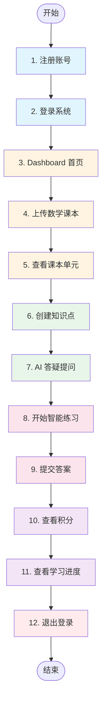

# 学习助手 - 测试场景与流程图

**文档版本**: v1.0  
**创建日期**: 2026-03-15 11:17  
**测试执行人**: QA 测试团队

---

## 📖 测试场景：小明同学的学习之旅

### 场景背景

| 项目 | 内容 |
|------|------|
| **主角** | 小明（小学 5 年级学生） |
| **时间** | 2026-03-15 晚上 8:00 |
| **地点** | 家中 |
| **设备** | 电脑浏览器 |
| **目标** | 复习数学"勾股定理" |

---

## 🔄 完整测试流程（12 个节点）

---

## 📋 详细测试步骤

### 节点 1：注册账号

**场景**: 小明第一次使用学习助手

**操作步骤**:
1. 打开首页 `http://localhost:5173`
2. 点击"立即注册"
3. 填写表单：
   - 手机号：`13800138000`
   - 验证码：`123456`
   - 用户类型：学生
   - 年级：5 年级
   - 昵称：小明
4. 点击"注册"

**预期结果**:
- ✅ 注册成功提示
- ✅ 自动跳转登录页

**测试截图**: `01-register-success.png`

---

### 节点 2：登录系统

**场景**: 小明使用刚注册的账号登录

**操作步骤**:
1. 输入手机号：`13800138000`
2. 点击"获取验证码"
3. 输入验证码：`123456`
4. 点击"登录"

**预期结果**:
- ✅ 登录成功
- ✅ 跳转到 Dashboard
- ✅ Dashboard 显示"欢迎小明"

**测试截图**: `02-login-dashboard.png`

---

### 节点 3：Dashboard 首页

**场景**: 小明查看学习概览

**操作步骤**:
1. 查看 4 个统计卡片
2. 查看导航栏

**预期结果**:
- ✅ 显示 4 个统计卡片（学习时长/知识点/答题数/积分）
- ✅ 导航栏显示：知识点 | AI 答疑 | 学习进度 | 积分 | 课本管理

**测试截图**: `03-dashboard-overview.png`

---

### 节点 4：上传数学课本

**场景**: 小明上传五年级数学课本 PDF

**操作步骤**:
1. 点击导航栏"课本管理"
2. 点击"上传 PDF 课本"
3. 选择文件：`五年级数学.pdf`
4. 填写信息：
   - 标题：五年级数学上册
   - 科目：数学
   - 年级：5 年级
5. 点击"上传"

**预期结果**:
- ✅ 上传成功提示
- ✅ 显示上传进度 100%
- ✅ 课本列表显示新书本

**测试截图**: 
- `04-textbook-upload.png`
- `04a-textbook-upload-progress.png`

---

### 节点 5：查看课本单元

**场景**: 小明查看刚上传的数学课本单元

**操作步骤**:
1. 在课本列表点击"五年级数学上册"
2. 点击"查看单元"
3. 查看单元列表

**预期结果**:
- ✅ 显示单元列表
- ✅ 显示"第一单元：小数乘法"
- ✅ 显示"第二单元：位置"
- ✅ 显示"第五单元：简易方程"

**测试截图**: `05-textbook-units.png`

---

### 节点 6：创建知识点

**场景**: 小明创建"勾股定理"知识点

**操作步骤**:
1. 点击导航栏"知识点"
2. 点击"创建知识点"
3. 填写信息：
   - 名称：勾股定理
   - 科目：数学
   - 年级：5 年级
   - 难度：中等
   - 描述：直角三角形两直角边的平方和等于斜边的平方
4. 点击"保存"

**预期结果**:
- ✅ 创建成功提示
- ✅ 知识点列表显示"勾股定理"

**测试截图**: 
- `06-knowledge-create.png`
- `06a-knowledge-list.png`

---

### 节点 7：AI 答疑提问

**场景**: 小明向 AI 助手提问"什么是勾股定理？"

**操作步骤**:
1. 点击导航栏"AI 答疑"
2. 在输入框输入："什么是勾股定理？"
3. 点击"提问"
4. 等待 AI 回复（阿里云 API）

**预期结果**:
- ✅ AI 回复完整定义
- ✅ AI 回复包含公式：a² + b² = c²
- ✅ 历史记录保存问答

**测试截图**: `07-ai-answer.png`

---

### 节点 8：开始智能练习

**场景**: 小明开始做"勾股定理"练习题

**操作步骤**:
1. 点击导航栏"智能练习"
2. 选择知识点："勾股定理"
3. 选择题数：5 道
4. 点击"开始练习"
5. 查看第 1 题

**预期结果**:
- ✅ 显示第 1 题题目
- ✅ 显示选项（单选）或输入框（填空）
- ✅ 显示题号（1/5）

**测试截图**: `08-practice-start.png`

---

### 节点 9：提交答案

**场景**: 小明完成 5 道题并提交

**操作步骤**:
1. 依次回答 5 道题
2. 答对 4 题，答错 1 题
3. 点击"提交试卷"

**预期结果**:
- ✅ 显示得分：80 分
- ✅ 显示正确率：80%
- ✅ 显示答题详情（每题对错）
- ✅ 显示答案解析

**测试截图**: `09-practice-result.png`

---

### 节点 10：查看积分

**场景**: 小明查看练习获得的积分

**操作步骤**:
1. 点击导航栏"积分"
2. 查看积分余额
3. 查看积分流水

**预期结果**:
- ✅ 积分余额显示 +50
- ✅ 积分流水显示：
  - 答对 4 题：+40 分（每题 10 分）
  - 正确率≥80%：+10 分（奖励）

**测试截图**: 
- `10-points-balance.png`
- `10a-points-ledger.png`

---

### 节点 11：查看学习进度

**场景**: 小明查看今天的学习统计

**操作步骤**:
1. 点击导航栏"学习进度"
2. 查看统计卡片
3. 查看学习记录列表

**预期结果**:
- ✅ 显示"今日学习 30 分钟"
- ✅ 显示"答题 5 道"
- ✅ 显示"正确率 80%"
- ✅ 学习记录列表显示本次练习

**测试截图**: `11-progress-stats.png`

---

### 节点 12：退出登录

**场景**: 小明完成学习，退出账号

**操作步骤**:
1. 点击右上角用户头像
2. 点击"退出登录"
3. 确认退出

**预期结果**:
- ✅ 退出成功提示
- ✅ 跳转到登录页
- ✅ 无法访问受保护页面

**测试截图**: `12-logout-success.png`

---

## 📊 测试截图清单

| 序号 | 文件名 | 场景 | 状态 |
|------|--------|------|------|
| 01 | `01-register-success.png` | 注册成功 | ⏳ 待测试 |
| 02 | `02-login-dashboard.png` | 登录 Dashboard | ⏳ 待测试 |
| 03 | `03-dashboard-overview.png` | Dashboard 概览 | ⏳ 待测试 |
| 04 | `04-textbook-upload.png` | 课本上传 | ⏳ 待测试 |
| 04a | `04a-textbook-upload-progress.png` | 上传进度 | ⏳ 待测试 |
| 05 | `05-textbook-units.png` | 课本单元 | ⏳ 待测试 |
| 06 | `06-knowledge-create.png` | 创建知识点 | ⏳ 待测试 |
| 06a | `06a-knowledge-list.png` | 知识点列表 | ⏳ 待测试 |
| 07 | `07-ai-answer.png` | AI 回复 | ⏳ 待测试 |
| 08 | `08-practice-start.png` | 开始练习 | ⏳ 待测试 |
| 09 | `09-practice-result.png` | 练习结果 | ⏳ 待测试 |
| 10 | `10-points-balance.png` | 积分余额 | ⏳ 待测试 |
| 10a | `10a-points-ledger.png` | 积分流水 | ⏳ 待测试 |
| 11 | `11-progress-stats.png` | 学习进度 | ⏳ 待测试 |
| 12 | `12-logout-success.png` | 退出登录 | ⏳ 待测试 |

**总计**: 15 张截图

---

## ✅ 测试检查清单

### 前置条件
- [ ] 后端服务运行正常
- [ ] 前端服务运行正常
- [ ] 数据库连接正常
- [ ] AI API 配置完成（阿里云）
- [ ] 测试 PDF 文件准备就绪

### 测试执行
- [ ] 12 个步骤全部执行
- [ ] 15 张截图全部保存
- [ ] 数据流连贯性验证通过
- [ ] 所有验证点检查通过

### 输出文件
- [ ] `docs/test-reports/full-test-scenario.md`
- [ ] `docs/screenshots/01-*.png` ~ `12-*.png`
- [ ] 测试执行时间记录

---

**文档创建时间**: 2026-03-15 11:17  
**测试状态**: 🔄 执行中  
**预计完成**: 20 分钟内
