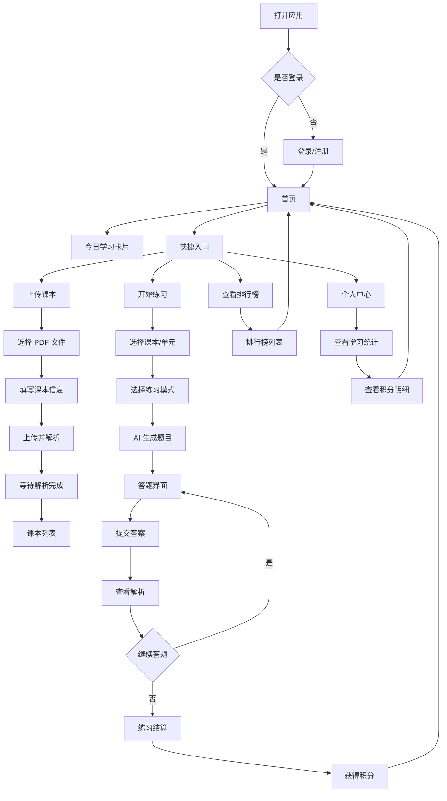
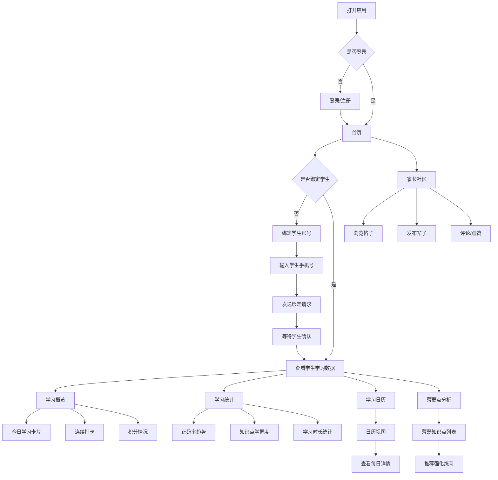
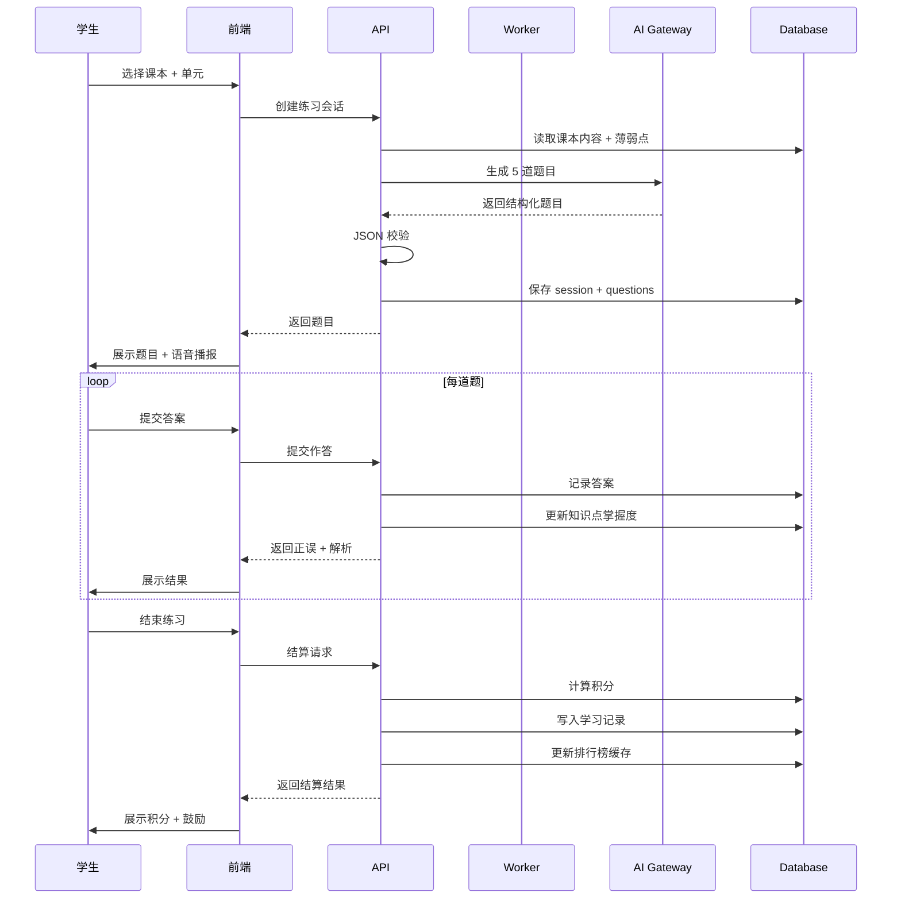

# 学习助手 V1 产品设计文档

**文档版本**: v1.0  
**创建日期**: 2026-03-15  
**依据 PRD**: v1.1 可研发落地稿  
**产品形态**: H5 + 微信小程序  

---

## 📋 文档目录

1. [用户流程图](#1-用户流程图)
2. [核心功能清单](#2-核心功能清单)
3. [页面原型建议](#3-页面原型建议)
4. [交互细节说明](#4-交互细节说明)
5. [MVP 功能范围](#5-mvp 功能范围)
6. [V1.1/V1.2 延后功能](#6-v11v12 延后功能)

---

## 1. 用户流程图

### 1.1 学生用户核心流程



### 1.2 家长用户核心流程



### 1.3 核心学习闭环流程



---

## 2. 核心功能清单

### 2.1 功能优先级定义

| 优先级 | 说明 | 标准 |
|--------|------|------|
| **P0** | MVP 核心功能 | 缺少则无法形成学习闭环 |
| **P1** | 重要增强功能 | 显著提升体验，但可短期延后 |
| **P2** | 锦上添花功能 | 有更好，无也可用 |

### 2.2 功能清单总表

| 模块 | 功能点 | 优先级 | 版本 | 说明 |
|------|--------|--------|------|------|
| **账号与家庭** | 手机号验证码登录 | P0 | V1 | 学生/家长通用 |
| | 学生注册（年级/学校） | P0 | V1 | 必填年级 |
| | 家长注册（真实姓名） | P0 | V1 | 必填真实姓名 |
| | 家庭绑定（家长绑定学生） | P0 | V1 | 需学生确认 |
| | 解绑功能 | P1 | V1.1 | 可延后 |
| **首页** | 今日学习卡片 | P0 | V1 | 时长/题数/正确率 |
| | 连续打卡展示 | P1 | V1.1 | 展示但不奖励 |
| | 学习建议 | P1 | V1.1 | 基于薄弱点 |
| | 快捷入口（4 个） | P0 | V1 | 课本/练习/排行/个人 |
| **课本管理** | PDF 上传（直传 OSS） | P0 | V1 | 客户端直传 |
| | 课本列表 | P0 | V1 | 封面/标题/进度 |
| | 课本详情（单元树） | P0 | V1 | 展示章节结构 |
| | 课本解析状态查询 | P0 | V1 | 轮询或订阅 |
| | 重新解析 | P2 | V1.2 | 可延后 |
| | 删除课本 | P1 | V1.1 | 可延后 |
| **智能练习** | 按课本 + 单元出题 | P0 | V1 | AI 生成 5 题 |
| | 按薄弱点出题 | P1 | V1.1 | 个性化推荐 |
| | 题型支持（单选/填空/判断） | P0 | V1 | 三种基础题型 |
| | 答题界面 | P0 | V1 | 选项/输入/提交 |
| | 即时反馈（正误 + 解析） | P0 | V1 | 提交即显示 |
| | 语音播报题目 | P1 | V1.1 | H5 浏览器语音 |
| **学习记录** | 历史记录列表 | P0 | V1 | 按时间排序 |
| | 统计卡片（4 项） | P0 | V1 | 时长/题数/正确率/积分 |
| | 学习日历 | P1 | V1.1 | 热力图展示 |
| | 薄弱点分析 | P1 | V1.1 | 知识点掌握度 |
| **积分系统** | 答题积分（+10/题） | P0 | V1 | 答对得分 |
| | 正确率奖励（+20） | P0 | V1 | ≥80% 额外奖励 |
| | 积分明细 | P0 | V1 | 流水记录 |
| | 等级系统 | P2 | V1.2 | 可延后 |
| **排行榜** | 总榜 | P0 | V1 | 全平台积分排名 |
| | 周榜 | P1 | V1.1 | 每周重置 |
| | 月榜 | P2 | V1.2 | 可延后 |
| | 科目榜 | P2 | V1.2 | 可延后 |
| **家长社区** | 帖子列表 | P2 | V1.1 | 延后到 V1.1 |
| | 发帖功能 | P2 | V1.1 | 仅家长账号 |
| | 评论/点赞/收藏 | P2 | V1.1 | 延后到 V1.1 |
| | 敏感词过滤 | P2 | V1.1 | 延后到 V1.1 |
| **错题本** | 错题自动收录 | P2 | V1.1 | 延后到 V1.1 |
| | 错题重做 | P2 | V1.1 | 延后到 V1.1 |
| | 相似题推荐 | P2 | V1.2 | 需要 pgvector |
| **学习报告** | 周报 | P2 | V1.2 | 延后到 V1.2 |
| | 月报 | P2 | V1.2 | 延后到 V1.2 |
| | 导出 PDF | P2 | V1.2 | 延后到 V1.2 |

---

## 3. 页面原型建议

### 3.1 现有页面对比分析

| 现有页面 | PRD 要求 | 差距分析 | 建议 |
|----------|----------|----------|------|
| `Login.jsx` | 手机号验证码登录 | ✅ 基本符合，支持内测验证码 | 保留，增加微信登录入口（预留） |
| `Register.jsx` | 学生/家长分角色注册 | ✅ 支持角色选择 | 保留，简化字段（学校改为可选） |
| `Dashboard.jsx` | 首页学习卡片 | ❌ 仅展示统计，无快捷入口 | **重构**为 V1 首页 |
| `Knowledge.jsx` | 知识点管理 | ❌ 面向管理员，非学生视角 | **废弃**，改为后台功能 |
| `Progress.jsx` | 学习进度 | ❌ 手动记录时长，非自动 | **重构**为学习记录页 |
| `AIChat.jsx` | AI 答疑 | ❌ 通用问答，非题目相关 | **废弃**，整合到练习解析 |

### 3.2 V1 需要新增的页面

| 页面名称 | 路由 | 优先级 | 说明 |
|----------|------|--------|------|
| 家庭绑定页 | `/family/bind` | P0 | 家长绑定学生账号 |
| 课本列表页 | `/textbooks` | P0 | 展示已上传课本 |
| 课本上传页 | `/textbooks/upload` | P0 | 选择 PDF + 填写元数据 |
| 课本详情页 | `/textbooks/:id` | P0 | 单元树 + 解析状态 |
| 练习选择页 | `/practice/select` | P0 | 选择课本/单元/模式 |
| 答题页 | `/practice/:sessionId` | P0 | 答题界面 + 语音播报 |
| 练习结算页 | `/practice/:sessionId/finish` | P0 | 积分 + 正确率展示 |
| 学习记录页 | `/learning/records` | P0 | 历史记录列表 |
| 学习统计页 | `/learning/stats` | P0 | 统计卡片 + 图表 |
| 积分明细页 | `/points/ledger` | P0 | 积分流水 |
| 排行榜页 | `/leaderboard` | P0 | 总榜 + 我的排名 |
| 个人中心页 | `/profile` | P0 | 用户信息 + 设置 |
| 家长学生概览页 | `/family/students/:id` | P1 | 家长查看孩子数据 |
| 学习日历页 | `/learning/calendar` | P1 | 热力图展示 |
| 薄弱点分析页 | `/learning/weaknesses` | P1 | 知识点掌握度 |
| 帖子列表页 | `/community` | P2 | V1.1 实现 |
| 发帖页 | `/community/post` | P2 | V1.1 实现 |

### 3.3 页面结构建议

```
frontend/src/pages/
├── auth/
│   ├── Login.jsx              # 登录页（保留优化）
│   ├── Register.jsx           # 注册页（保留优化）
│   └── FamilyBind.jsx         # 【新增】家庭绑定页
│
├── home/
│   ├── Dashboard.jsx          # 【重构】首页（学习卡片 + 快捷入口）
│   └── Profile.jsx            # 【新增】个人中心
│
├── textbooks/
│   ├── TextbookList.jsx       # 【新增】课本列表
│   ├── TextbookUpload.jsx     # 【新增】课本上传
│   └── TextbookDetail.jsx     # 【新增】课本详情（单元树）
│
├── practice/
│   ├── PracticeSelect.jsx     # 【新增】练习选择
│   ├── PracticeAnswer.jsx     # 【新增】答题页
│   └── PracticeFinish.jsx     # 【新增】练习结算
│
├── learning/
│   ├── LearningRecords.jsx    # 【新增】学习记录
│   ├── LearningStats.jsx      # 【新增】学习统计
│   ├── LearningCalendar.jsx   # 【新增】学习日历（V1.1）
│   └── LearningWeaknesses.jsx # 【新增】薄弱点分析（V1.1）
│
├── points/
│   ├── PointsBalance.jsx      # 【新增】积分余额
│   └── PointsLedger.jsx       # 【新增】积分明细
│
├── leaderboard/
│   └── Leaderboard.jsx        # 【新增】排行榜
│
├── family/
│   └── StudentOverview.jsx    # 【新增】家长查看学生概览（V1.1）
│
└── community/
    ├── CommunityList.jsx      # 【新增】帖子列表（V1.1）
    └── CommunityPost.jsx      # 【新增】发帖页（V1.1）
```

---

## 4. 交互细节说明

### 4.1 登录注册流程

**登录页**
- 默认显示手机号输入框
- 点击"获取验证码"后进入 60 秒倒计时
- 内测期间显示提示：💡 内测期间请使用固定验证码 **123456**
- 登录成功后根据角色跳转不同首页（学生→Dashboard，家长→家庭绑定引导）

**注册页**
- 角色选择使用卡片式单选（👨‍🎓 学生 / 👪 家长）
- 学生必填：年级（下拉选择 1-6 年级）
- 学生可选：学校名称
- 家长必填：真实姓名
- 注册成功后自动登录

### 4.2 家庭绑定流程

**家长端**
1. 进入"绑定孩子"页面
2. 输入学生手机号
3. 点击"发送绑定请求"
4. 显示"等待学生确认"状态

**学生端**
1. 首页出现"待确认绑定"通知
2. 点击进入确认页
3. 显示家长信息（手机号、昵称）
4. 点击"确认绑定"完成

**绑定后**
- 家长可在"我的孩子"页面查看已绑定学生
- 支持切换查看多个学生的学习数据
- 支持解绑（需二次确认）

### 4.3 课本上传流程

**步骤 1: 选择文件**
- 支持点击上传或拖拽上传
- 限制：仅 PDF 格式，最大 50MB
- 显示文件名和大小

**步骤 2: 填写信息**
- 课本标题（必填）
- 科目（单选：语文/数学/英语）
- 年级（下拉：1-6 年级）
- 学期（单选：上学期/下学期）
- 版本（可选：人教版/北师大版等）

**步骤 3: 上传解析**
- 客户端直传 OSS（显示上传进度条）
- 上传完成后创建课本记录
- 自动进入"解析中"状态
- 显示预计等待时间（约 30-60 秒）

**解析状态展示**
- 🔄 解析中 - 显示进度条
- ✅ 解析完成 - 显示单元数量
- ❌ 解析失败 - 显示原因 + 重试按钮

### 4.4 练习流程

**练习选择页**
- 展示已解析完成的课本列表
- 点击课本进入单元选择
- 单元树展示：单元 → 章节 → 小节
- 练习模式选择：
  - 📖 同步练习（按课本单元）
  - 💪 薄弱点强化（基于历史数据）
  - 🎯 快速练习（随机 5 题）

**答题页**
- 顶部显示：当前题号/总题数（1/5）
- 题目区域：题干 + 选项（或填空输入框）
- 底部按钮：
  - "提交答案"（当前题）
  - "上一题"（可回看修改）
  - "下一题"（当前题未提交时禁用）
- 语音播报按钮：🔊 点击朗读题目
- 倒计时显示（可选，默认不限时）

**答题反馈**
- 提交后立即显示正误
- 正确答案用绿色高亮
- 错误答案用红色标记
- 解析区域可展开/收起
- 自动跳转到下一题（2 秒后）

**练习结算页**
- 显示本次练习统计：
  - 正确率（大字号突出）
  - 正确题数/总题数
  - 用时
  - 获得积分
- 积分动画效果（+10 +10 +20 飘字）
- 按钮：
  - "再来一次"（重新练习当前单元）
  - "返回课本"（回到课本详情）
  - "返回首页"

### 4.5 排行榜交互

**排行榜页**
- Tab 切换：总榜 | 周榜 | 月榜 | 科目榜
- 列表展示：
  - 排名（1-3 名特殊图标🥇🥈🥉）
  - 头像
  - 昵称（脱敏处理）
  - 积分
- 我的排名固定在底部（即使不在前 100）
- 下拉刷新

### 4.6 家长查看学生数据

**学生概览页（家长视角）**
- 顶部切换：如有多个孩子可切换
- 今日学习卡片：
  - 学习时长
  - 完成题数
  - 正确率
  - 获得积分
- 连续打卡：显示当前连续天数
- 快捷入口：
  - 查看详细统计
  - 查看学习日历
  - 查看薄弱点
  - 发送鼓励消息（V1.1）

**学习统计页（家长视角）**
- 正确率趋势图（近 7 天/近 30 天）
- 知识点掌握度 Top 5 / Bottom 5
- 学习时长分布（按科目）
- 积分获取趋势

---

## 5. MVP 功能范围

### 5.1 V1 上线必备功能（P0）

**账号体系**
- [ ] 手机号验证码登录
- [ ] 学生注册（年级必填）
- [ ] 家长注册（真实姓名必填）
- [ ] 家庭绑定（家长发起→学生确认）

**课本管理**
- [ ] PDF 上传（客户端直传 OSS）
- [ ] 课本列表（封面/标题/解析状态）
- [ ] 课本详情（单元树展示）
- [ ] 解析状态查询（轮询）

**智能练习**
- [ ] 按课本 + 单元生成题目（AI 生成 5 题）
- [ ] 题型支持（单选题、填空题、判断题）
- [ ] 答题界面（选项/输入/提交）
- [ ] 即时反馈（正误 + 解析）

**学习记录**
- [ ] 历史记录列表（按时间排序）
- [ ] 统计卡片（时长/题数/正确率/积分）

**积分系统**
- [ ] 答题积分（答对 +10）
- [ ] 正确率奖励（≥80% +20）
- [ ] 积分明细（流水记录）

**排行榜**
- [ ] 总榜（全平台积分排名）
- [ ] 我的排名定位

**基础页面**
- [ ] 首页（学习卡片 + 4 个快捷入口）
- [ ] 个人中心（用户信息/退出登录）

### 5.2 V1 技术基线

| 层级 | 技术选型 |
|------|----------|
| 前端 | Taro 4 + React 18 |
| 后端 | NestJS 10 |
| 数据库 | PostgreSQL 16 |
| 缓存/队列 | Redis 7 + BullMQ |
| 对象存储 | 阿里云 OSS |
| AI 网关 | 阿里云百炼 Qwen + DeepSeek |
| 部署 | Docker Compose |

### 5.3 V1 性能目标

| 指标 | 目标值 |
|------|--------|
| 首屏加载 | < 2 秒 |
| AI 出题 | < 5 秒 |
| 解析状态回传 | < 3 秒 |
| 语音播报触发 | < 1 秒 |
| 排行榜响应（缓存后） | < 300ms |

---

## 6. V1.1/V1.2 延后功能

### 6.1 V1.1 延后功能（P1）

**学习增强**
- [ ] 学习日历（热力图展示）
- [ ] 薄弱点分析（知识点掌握度可视化）
- [ ] 个性化学习建议（基于薄弱点）
- [ ] 语音播报题目（H5 浏览器语音）

**家长功能**
- [ ] 家长社区基础版（帖子/评论/点赞）
- [ ] 错题本（自动收录 + 重做）
- [ ] 连续打卡奖励（额外积分）
- [ ] 发送鼓励消息

**运营功能**
- [ ] 周榜（每周重置）
- [ ] 内容审核后台（社区帖子审核）
- [ ] 通知推送（学习提醒）

### 6.2 V1.2 延后功能（P2）

**智能增强**
- [ ] pgvector 向量检索启用
- [ ] 相似题推荐（基于向量相似度）
- [ ] 课本问答（RAG 增强）
- [ ] 深度分析报告（异步生成）

**学习报告**
- [ ] 周报（每周学习总结）
- [ ] 月报（月度学习分析）
- [ ] 报告导出（PDF 格式）

**排行榜扩展**
- [ ] 月榜
- [ ] 科目榜（语文/数学/英语分开排名）

**其他**
- [ ] 等级系统（积分兑换等级）
- [ ] 重新解析课本
- [ ] 删除课本
- [ ] 微信授权登录

---

## 附录

### A. 现有代码复用建议

| 现有文件 | 处理建议 | 说明 |
|----------|----------|------|
| `Login.jsx` | 保留优化 | 增加微信登录入口预留 |
| `Register.jsx` | 保留优化 | 简化字段，学校改为可选 |
| `Dashboard.jsx` | 重构 | 改为 V1 首页（学习卡片 + 快捷入口） |
| `Knowledge.jsx` | 废弃 | 改为后台管理功能 |
| `Progress.jsx` | 重构 | 改为学习记录页 |
| `AIChat.jsx` | 废弃 | 整合到练习解析功能 |

### B. 关键交互原型参考

**首页布局**
```
┌─────────────────────────────────┐
│ 🔔 通知    📚 学习助手    👤    │
├─────────────────────────────────┤
│  📊 今日学习                    │
│  ┌─────────────────────────┐    │
│  │ ⏱️ 25 分钟  ✅ 15 题     │    │
│  │ 🎯 85% 正确率  🔥 3 天   │    │
│  └─────────────────────────┘    │
│                                 │
│  🚀 快捷入口                    │
│  ┌─────┐ ┌─────┐ ┌─────┐ ┌────┐│
│  │📖 课本│ │✏️ 练习│ │🏆 排行│ │👤 我的││
│  └─────┘ └─────┘ └─────┘ └────┘│
│                                 │
│  📚 最近课本                    │
│  ┌─────────────────────────┐    │
│  │ 数学五年级上册          │    │
│  │ 已解析 8 个单元          │    │
│  └─────────────────────────┘    │
└─────────────────────────────────┘
```

**答题页布局**
```
┌─────────────────────────────────┐
│ ← 返回      1/5        🔊       │
├─────────────────────────────────┤
│                                 │
│  1. 下列哪个数是质数？          │
│                                 │
│  ○ A. 4                         │
│  ○ B. 7                         │
│  ○ C. 9                         │
│  ○ D. 12                        │
│                                 │
├─────────────────────────────────┤
│  ┌──────────┐  ┌──────────┐    │
│  │  上一题  │  │ 提交答案 │    │
│  └──────────┘  └──────────┘    │
└─────────────────────────────────┘
```

**练习结算页布局**
```
┌─────────────────────────────────┐
│        🎉 练习完成！            │
│                                 │
│           85%                   │
│         正确率                  │
│                                 │
│  ✅ 答对 4 题  ❌ 答错 1 题       │
│  ⏱️ 用时 3 分 25 秒              │
│                                 │
│  💰 获得积分                    │
│  +10 +10 +10 +10 +20 = 60      │
│                                 │
│  ┌──────────┐  ┌──────────┐    │
│  │ 再来一次 │  │ 返回首页 │    │
│  └──────────┘  └──────────┘    │
└─────────────────────────────────┘
```

---

**文档结束**
